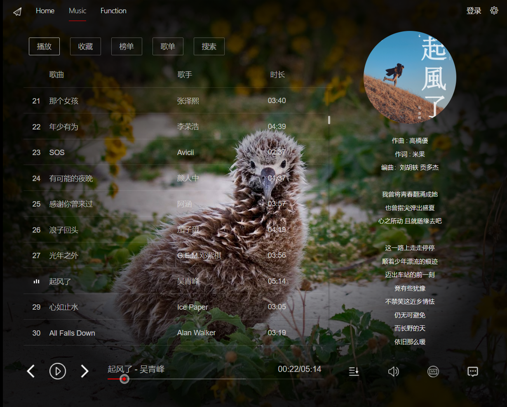

# 多平台音乐资源聚合爬虫

###本项目纯属个人开发练习，禁止任何商业用途

目前本项目已完成QQ音乐和网易云音乐的大部分常用功能聚合，用于解决各平台版权利益纷争引起的音乐试听不便的问题，另外本项目可能扩展为个人主页，并添加其他功能

**目前本项目已包含的功能模块如下：**

- [x] 首页天气、时间、必应壁纸获取
- [x] 音乐爬虫
- [x] 扩展功能

##音乐爬虫功能描述

前端使用Vue全家桶开发，以求各组件的解耦和前后台分离，简化开发

**前端的功能包括：**

- [x] 音乐Url获取
- [x] 音乐信息获取，包括时长、专辑封面和歌词等
- [x] 音乐评论获取
- [x] 音乐MV获取
- [x] 各平台排行榜以及详情获取
- [x] 各平台推荐歌单及详情获取
- [x] 搜索功能，包括单曲、歌手、专辑、视频、歌单和用户的搜索
- [x] 版权、付费提示、错误提示等

**后台的功能包括**

| 功能       |网易云音乐|  QQ音乐  |
| :--------:|:-----:|:----:|
| 音乐URL| √ | √ |
| 音乐是否可用| √ | √ |
| 音乐歌词 | √ | √ |
| 音乐详情 | √ | √ |
| 音乐评论 | √ | √ |
| MV地址 | √ | √ |
| 音乐封面 | √ | √ |
| 专辑详情 | √ | √ |
| 排行榜 | √ | √ |
| 榜单详情 | √ | √ |
| 歌单推荐 | √ | √ |
| 歌单详情 | √ | √ |
| 用户歌单 | √ | 4.22日后需登陆才可用 |
| 搜索单曲 | √ | √ |
| 搜索歌手 | √ | √ |
| 搜索专辑 | √ | √ |
| 搜索视频 | √ | √ |
| 搜索歌单 | √ | √ |
| 搜索用户 | √ | √ |

**API接口及返回数据如下 可在/api/xxx/index文件中重新封装数据**

##效果展示如下

##主页壁纸获取

##音乐爬虫功能

##附加功能部分

##音乐爬虫主页

##排行榜

##推荐歌单

##搜索

##评论

##MV

